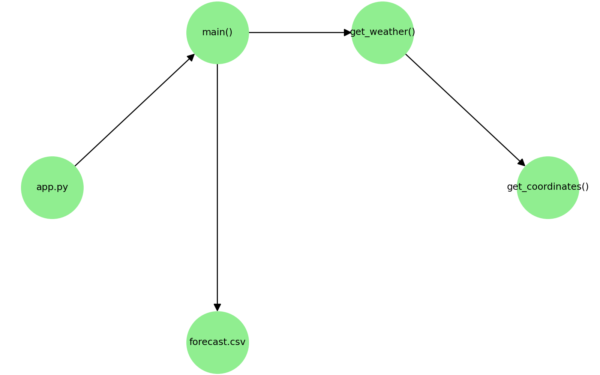

# 22050004_kido_kadai2
# 🌤 天気予報アプリ（Streamlit版）
 
## 📌 概要
このアプリは、ユーザーが入力した都市名をもとに **Open-Meteo API** から天気予報を取得し、画面に表示するシンプルなアプリです。  
さらに、取得したデータを **CSVファイルに保存** することもできます。  
 
APIキーや認証は不要で、誰でも利用可能です。  
学習用・デモアプリとして利用できます。  
 
---
 
## 🌍 使用API
- [Open-Meteo Weather API](https://open-meteo.com/)  
  → 緯度・経度から天気予報を取得  
- [Open-Meteo Geocoding API](https://open-meteo.com/en/docs/geocoding-api)  
  → 都市名から緯度・経度を取得  
 
---
## システム設計図

 
## コード説明図

---
 
## 📂 ファイル構成
weather-app/
├── app.py                 # Streamlitアプリ(UI部分)
├── weather.py             # APIアクセス処理
├── forecast.csv           # 保存される天気データ（実行後に生成）
├── static/
│ ├── system_design.png # システム設計図
│ └── code_structure.png # コード説明図
├── README.md # このファイル

アプリを起動
streamlit run app.py

課題３https://github.com/ShunsukeKido/22050004_kido_kadai2/blob/main/improvement.md

